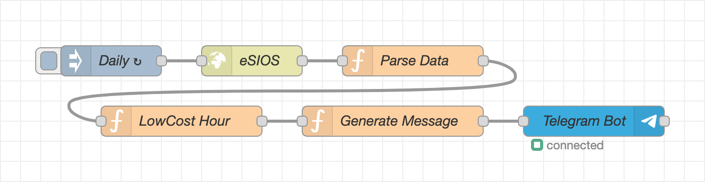

# Send [eSIOS] lowcost electricity price of the day
Here the possibility of sending the lowcost price of the day to [Telegram] or any other messaging system is reported.

This is an adaptation of the [Domotuto.com script] that uses the [eSIOS] API to get the data.

## Usage
1. Import the **[flow]** into **Node-RED**.
2. Modify the name of the calibrated and new devices.
2. Change the node `LowCost Hour` to indicate your `rateType`.
3. Deploy the **[flow]**.

## License
Licensed under the [Apache-2.0 License]

Read [LICENSE] for more information

[Telegram]: https://flows.nodered.org/node/node-red-contrib-telegrambot
[eSIOS]: https://www.esios.ree.es/
[Domotuto.com script]: https://domotuto.com/script-para-pvpc-que-bajara-el-precio-de-cada-hora-y-en-un-dummy-tipo-texto-mostrara-el-precio-actual-tambien-enviara-la-info-por-telegram-si-se-configura/
[flow]: flow.json
[Apache-2.0 License]: https://opensource.org/licenses/Apache-2.0
[LICENSE]: LICENSE
